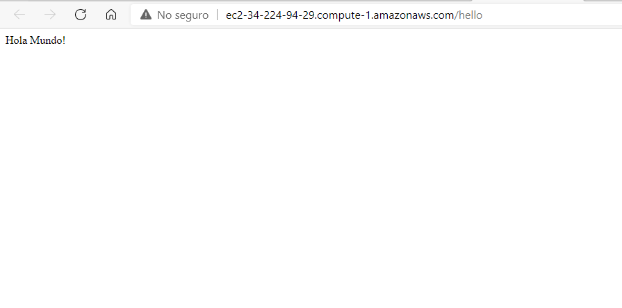
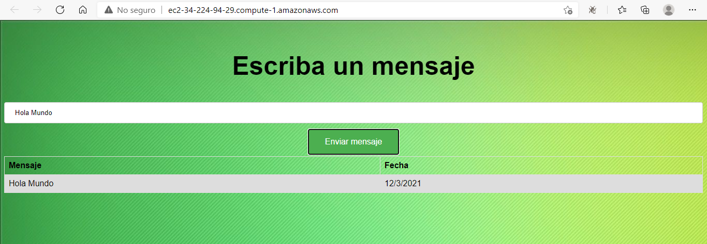
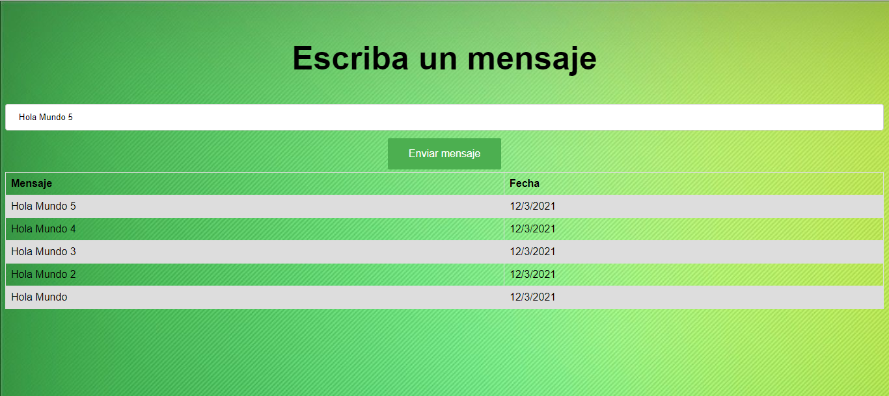
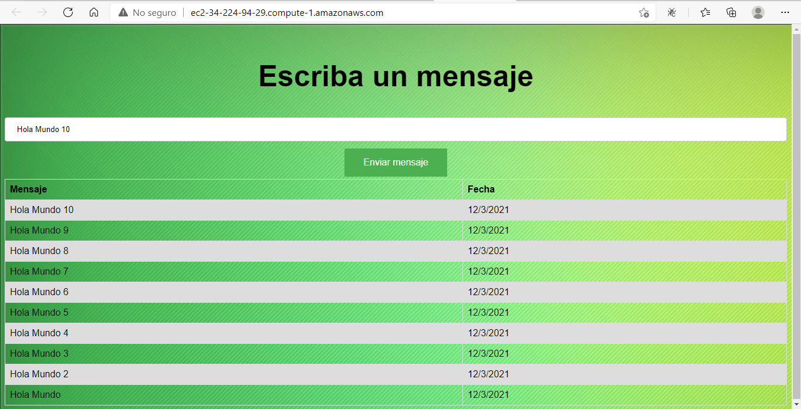

# Links de interés 
* [Aplicación web desplegada en EC2](http://ec2-34-224-94-29.compute-1.amazonaws.com/)
* [Repositorio de Log Service](https://github.com/germanAOQ/AREP-5-LogService.git)

# Taller de Modularización con Virtualización e Introducción a Docker y a AWS
### Pre-requisitos
Para hacer uso del software es necesario tener instalado:
* Maven: Automatiza y estandariza el flujo de vida de la construcción de software.                 
    Siga las instrucciones en http://maven.apache.org/download.cgi#Installation
* Git: Administrador descentralizado de configuraciones.                     
    Siga las instrucciones en http://git-scm.com/book/en/v2/Getting-Started-Installing-Git
* Docker Desktop: Automatizar el despliegue de aplicaciones dentro de contenedores de software                                   
    Siga las instrucciones en https://www.docker.com/products/docker-desktop
    
### Introducción
El taller se divide en dos partes:
- En la primera parte, se creó una aplicación web que retorna un saludo al usuario, utilizando SparkJava, Docker y Amazon EC2. SparkJava para crear la API Rest, Docker para
crear la imagen, subirla a un repositorio en DockerHub y crear el contenedor. Finalmente, se utilizó Amazon EC2 para crear una instancia de una máquina virtual Linux que
permitíera alojar el contenedor Docker creado previamente.
- En la segunda parte, se crearon 3 servicios que fueron desplegados en una máquina virtual de EC2 de AWS:
  - El servicio MongoDB es una instancia de MongoDB corriendo en un container de docker en una máquina virtual de EC2.
  - LogService es un servicio REST que recibe una cadena, la almacena en la base de datos y responde en un objeto JSON con las 10 ultimas cadenas almacenadas en la base de datos
    y la fecha en que fueron almacenadas.
  - La aplicación web APP-LB-RoundRobin está compuesta por un cliente web y al menos un servicio REST. El cliente web tiene un campo y un botón y cada vez que el usuario envía 
  un mensaje, este se lo envía al servicio REST y actualiza la pantalla con la información que este le regresa en formato JSON. El servicio REST recibe la cadena e implementa 
  un algoritmo de balanceo de cargas de Round Robin, delegando el procesamiento del mensaje y el retorno de la respuesta a cada una de las tres instancias del servicio LogService.
  
 ## Parte 1
 Accediendo al siguiente link se puede tener acceso a la aplicación web:                                                       
 http://ec2-34-224-94-29.compute-1.amazonaws.com/hello
 ## Generación de imágenes y contenedores Docker (Parte 2)
 En total el proyecto se compone de 3 imágenes, una para cada servicio, y 5 contenedores docker; uno para la aplicación web, 3 para el servicio log y uno para la base de datos.              
 1. Para desplegar el proyecto, se deben clonar los dos repisotorios que contienen la apliación web y el servicio log, en principio, para hacer algunas configuraciones:
   ```
   git clone https://github.com/germanAOQ/AREP-5-APPLBRoundRobin.git
   git clone https://github.com/germanAOQ/AREP-5-LogService.git
   ```
 2. Si tiene un servicio MongoDB propio ya desplegado en una máquina virtual de EC2 de AWS, puede modificar la URL y el puerto del cliente mongo presentes en el método **main**
 de la clase **SparkLogService** del segundo repositorio:
   ```
   ...
   post("/logservice", (request, response) -> {
              Mensaje mensaje = createMensaje(request.body());
              String json = new ObjectMapper().writeValueAsString(mensaje);
              MongoClient mongo = new MongoClient("ec2-34-224-94-29.compute-1.amazonaws.com",27017);
              DB db = mongo.getDB("mensaje");
              DBCollection collection = db.getCollection("cuerpo");
              DBObject dbObject = (DBObject) JSON.parse(json);
              collection.insert(dbObject);
   ...
   ```
   ```
   MongoClient mongo = new MongoClient("ec2-34-224-94-29.compute-1.amazonaws.com",27017);
 ```
 2. Para generar las imágenes y los contenedores de cada servicio se deben ejecutar los siguientes comandos:                                                     
  - En el directorio raíz del servicio web:                                                                                     
    Imagen:
    ```
    docker build --tag appserviceimage .
    ```
    Contenedor:
    ```
    docker run -d -p 42000:6000 --name appservice appserviceimage
    ```
  - En el directorio raíz del servicio log:                                                             
    Imagen:                                                       
      ```
      docker build --tag logserviceimage .
      ```                                                    
    Se deben generar 3 contenedores, según nos indican las instrucciones del taller:                                            
      ```
      docker run -d -p 34001:6000 --name logservice1 logserviceimage
      docker run -d -p 34002:6000 --name logservice2 logserviceimage
      docker run -d -p 34003:6000 --name logservice3 logserviceimage
      ```
   3. Adicionalmente, se debe modificar la URL de los log service presentes en el método **getServer** de la clase **SparkWebServer** del primer repositorio por las direcciones de 
   los contenedores **logservice** locales que se generaron en el punto anterior:
   ```
   ...
   private static String getServer(){
          String requestURL = null;
          switch (server){
              case 1:
                  requestURL = "";
                  server = 2;
                  break;
              case 2:
                  requestURL = "";
                  server = 3;
                  break;
              case 3:
                  requestURL = "";
                  server = 1;
                  break;
          }
          return requestURL;
      }
   ...
   ``` 
   Así, por ejemplo, el primer caso quedaría de la siguiente forma: 
  ```
  case 1:
       requestURL = "localhost:34001/logservice";
       server = 2;
       break;
   ```
   4. Finalmente, podrá acceder al cliente web con la dirección del contenedor del servicio web ```localhost:42000```
   
   En el siguiente link, se encuentra el taller ya desplegado en EC2:                                                      
   http://ec2-34-224-94-29.compute-1.amazonaws.com/
   ## Pruebas
   ### Pruebas de funcionamiento general (Parte 1)
   
   
   
   ### Pruebas de funcionamiento general (Parte 2)
   Para estas pruebas, se ingresan mensajes a la apliación. Se hacen 3 pruebas con 1, 5 y 10 mensajes respectivamente:  
   
   
   
   
   
   
   
## Documentación
### Generar documentación
Para generar la documentación se debe agregar al código del archivo de configuración de Maven, POM.xml, el siguiente plugin:
```
<plugin>
	<groupId>org.apache.maven.plugins</groupId>
	<artifactId>maven-javadoc-plugin</artifactId>
	<executions>
		<execution>
			<id>attach-javadocs</id>
			<goals>
				<goal>jar</goal>
			</goals>
		</execution>
	</executions>
</plugin>

```
Uno vez agregado el plugin anterior, se ejecuta el siguiente comando para generar el javadoc
```
mvn install
```
Finalmente, en la carpeta target quedará creado un archivo con el nombre **apidocs**, lugar en donde se encontrará la documentación.
## Construido con 
* [Maven](https://maven.apache.org/) - Manejador de dependencias
* [Git](https://github.com/) - Control de versionamiento
* [Docker](https://www.docker.com/) - Administrador de contenedores 
* [EC2](https://aws.amazon.com/es/ec2/) - Plataforma de despliegue
* [Circle CI]() - Integración Continua

## Autores 
* [Germán Andrés Ospina Quintero](https://github.com/germanAOQ)

## Licencia 📄
Este proyecto esta licenciado por GNU General Public License v3.0
  
